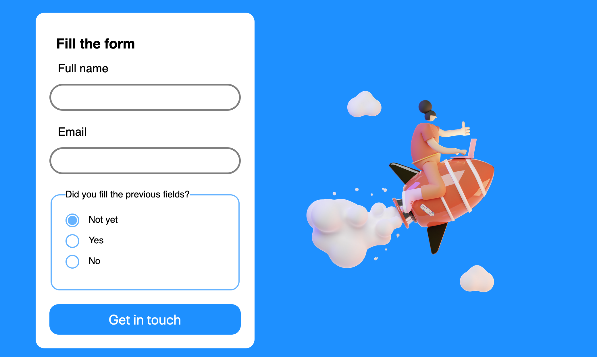
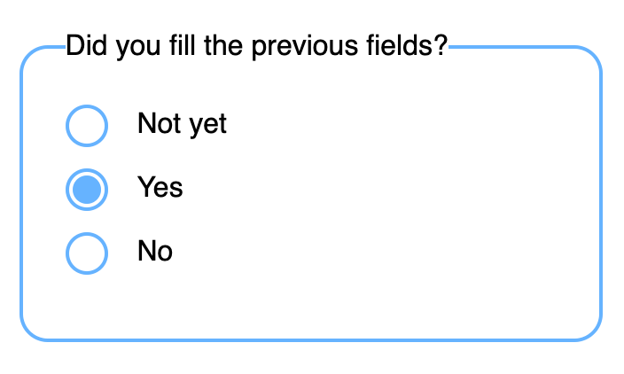

# Contact form

Create a contact form like shown in the mockup below.

1. give different styles for separate input states, :focus, :valid, :invalid
1. use a custom style for the radio buttons as shown in the second picture
1. pay particular attention to how you group form elements together

## Main mockup

## Radio controls detail
